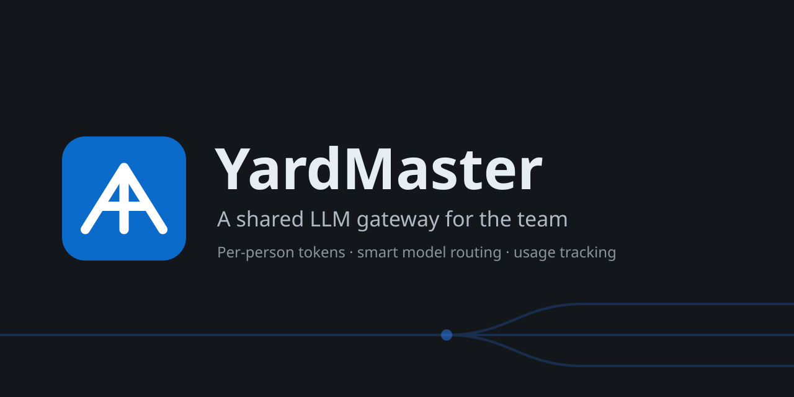
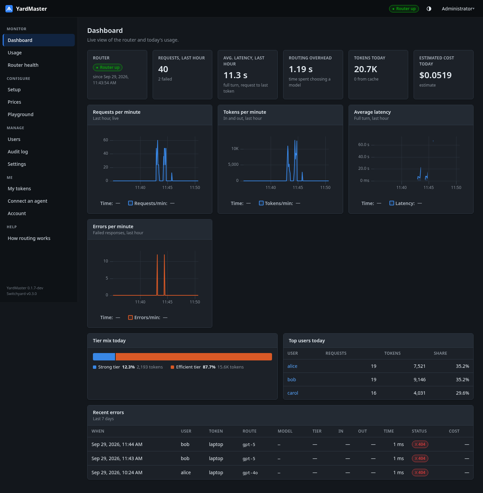
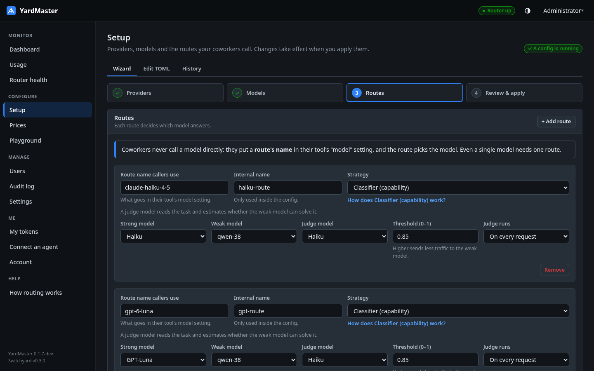
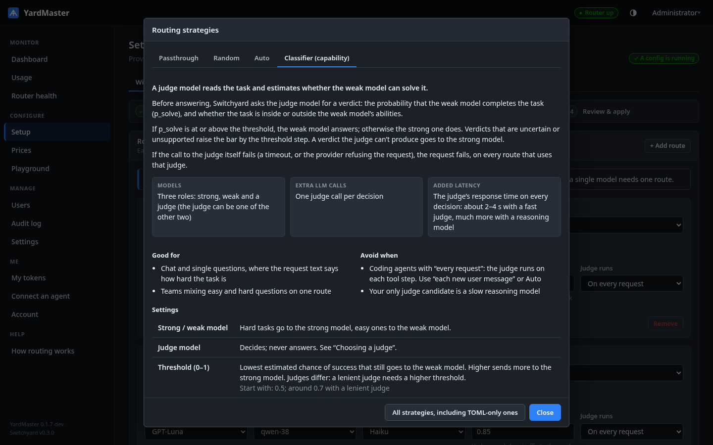
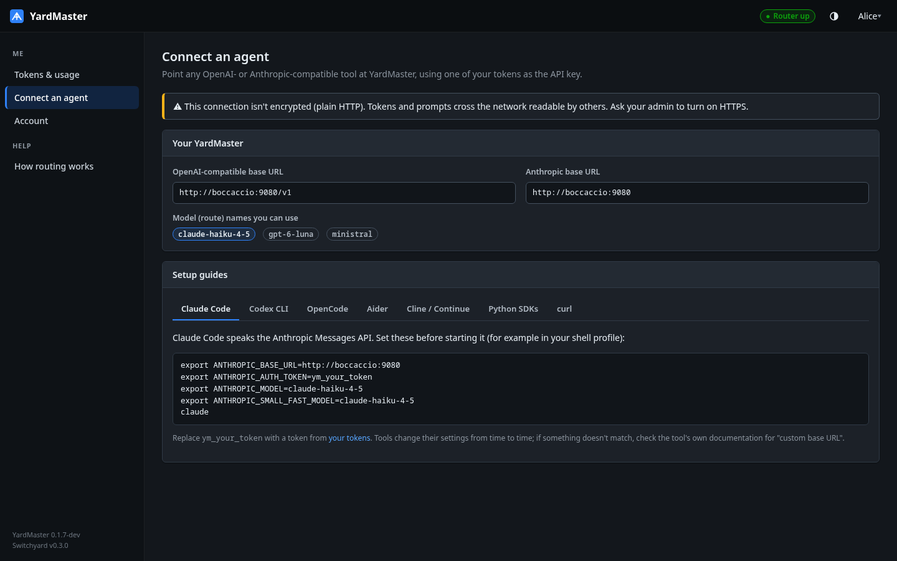
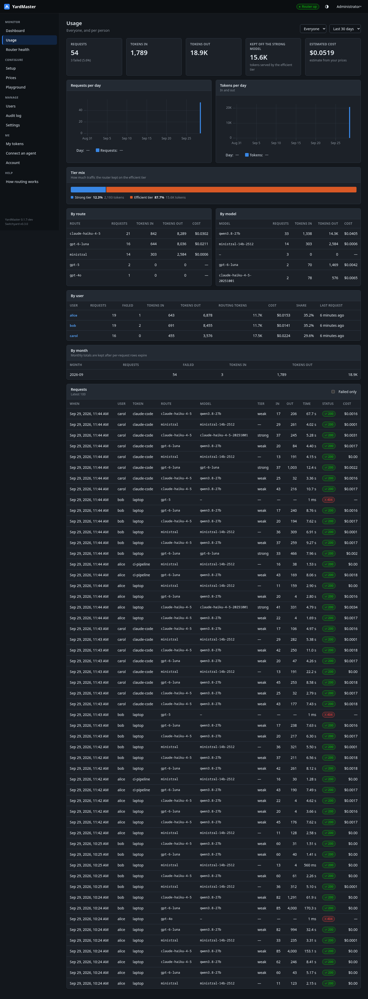

[](https://github.com/bricke/YardMaster/actions/workflows/ci.yml)
[](LICENSE)
[](go.mod)
[](web/package.json)
[](docs/install.md)

YardMaster is software with two proxies inside, delivered as a Docker image:

- **YardMaster's gateway** is what your team's tools talk to. It checks each person's token, strips
  it off, labels the request with who sent it, and passes it on.
- **[Switchyard](https://github.com/NVIDIA-NeMo/Switchyard)** is the LLM router behind it. It picks
  a model for each request and forwards the request to the provider, translating between the
  OpenAI and Anthropic API formats where needed.

```
tools (Claude Code, Codex, SDKs…) ──ym_ token──▶ YardMaster gateway ──▶ Switchyard ──▶ providers
browsers ──────────────session─────────────────▶ YardMaster UI          (container only)
```

Prompts and responses pass through but are never stored. YardMaster keeps only metadata: who sent
a request, the route and model, how many tokens, how long it took, and whether it worked.



## Set up routing without writing TOML

A wizard takes you through providers, models and routes. A route can send easy requests to a cheap
model and hard ones to a strong model, with a judge model deciding. YardMaster checks the config
with Switchyard itself, shows what changed, and restarts the router gracefully. If the router
doesn't come back healthy, the previous config goes back automatically.



Every routing strategy is explained in the app, including how to choose a judge.



## One gateway for everyone

The admin adds people. Each person creates their own tokens and follows a setup guide for their
tool. Any OpenAI- or Anthropic-compatible tool works unchanged. Nobody sees the provider keys, and
deactivating one person cuts off only their access.



## See who uses what

Usage by person, token, route, model and tier. You can see how much traffic the router kept off
the expensive models, what the judge itself cost and, once you enter your prices, estimated costs.
People see only their own usage; the admin sees everyone's.



## Also included

- Reasoning controls per model, in the format each provider accepts, and a timeout per provider.
- HTTPS with YardMaster's own certificate authority, or your own certificate.
- An audit log of every change.
- A trusted-proxy mode, for running behind another proxy that handles sign-in and TLS.

## Quick start

```bash
make image
docker run -d --name yardmaster --restart unless-stopped \
  -p 8080:8080 -p 8443:8443 -v yardmaster-data:/data \
  -e YARDMASTER_SECRET_KEY="$(openssl rand -base64 32)" \
  yardmaster
docker logs yardmaster        # shows a one-time setup code
```

Then open `http://<host>:8080`. Keep the secret key safe: it encrypts your provider keys, and
without it they can't be read back. [install.md](docs/install.md) has the full steps, and how to
run YardMaster without Docker.

## Documentation

- [Installing and running](docs/install.md): the image or a standalone build, first sign-in, HTTPS,
  running behind another proxy, configuration and backups.
- [User guide](docs/guide.md): every screen, for the admin and for users.
- [Tested with](docs/tested.md): the providers and models tried so far, and what we learned.
- [Development](docs/development.md): building, running locally and the checks to run before
  committing.
- [Architecture](docs/architecture.md): components, request paths, data on disk and the code
  layout.
- [Switchyard reference](docs/switchyard-reference.md): the parts of Switchyard that YardMaster
  relies on.
- [Security](SECURITY.md): how to report a vulnerability, and what's in scope.
- [Contributing](CONTRIBUTING.md): issues and suggestions are welcome; pull requests aren't
  accepted yet.

## Design principles

- **Upstream stays untouched.** Switchyard is used through its public CLI, configuration and HTTP
  API. There's no fork and no patches, so upgrading Switchyard means changing a pinned version.
- **Honest numbers.** Unknown values show as unknown, never as zero. Costs are estimates and are
  labeled as such.
- **Secrets stay secret.** Keys, tokens and passwords are never shown, returned or logged.
- **Maintainable by people.** Go and Svelte with few dependencies, plain code, and one obvious
  place for each concern.

## License

YardMaster is licensed under the [GNU Affero General Public License v3.0](LICENSE). For other
licensing terms, contact the author.

The Docker image also contains Switchyard, which is licensed under Apache-2.0; its `LICENSE` and
`NOTICE` files are in `/usr/share/doc/switchyard/` in the image.
