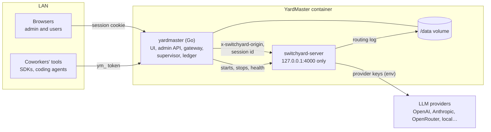
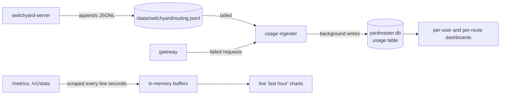
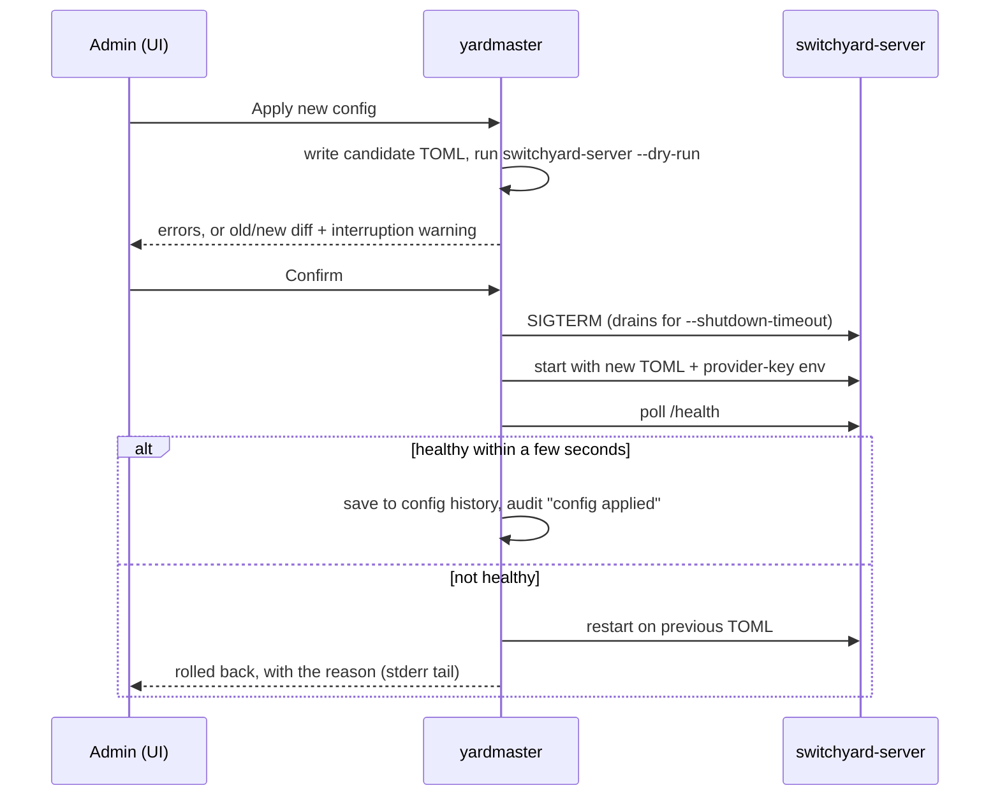

# Architecture

How YardMaster is put together: components, ports, request paths, data on disk, code layout and
the order it was built in.

> **Status:** MVP built (2026-09-28). This file describes the code as it is; keep it in step.

## Components

One container runs two processes:



- **`yardmaster`**: one static Go binary with the Svelte UI embedded. It is the only
  thing clients talk to. It serves the UI and admin API, runs the gateway, supervises
  `switchyard-server`, reads its routing log into the ledger, and scrapes its metrics.
- **`switchyard-server`**: built from a pinned upstream commit and used only through its CLI,
  TOML and HTTP API. It listens on `127.0.0.1:4000`, so nothing outside the container can
  reach it. Its provider keys come from the environment `yardmaster` starts it with.

## Ports

| Port | Plain HTTP (no TLS yet) | HTTPS active | Behind another proxy |
|---|---|---|---|
| 8080 | UI, admin API, gateway | Setup page only: CA download, trust instructions, name check, health. Gateway and API paths get an error, never a redirect | UI, admin API, gateway (reached only by the front proxy) |
| 8443 | not bound | UI, admin API, gateway | not bound |
| 4000 | inside the container only | inside the container only | inside the container only |
| 4001 | loopback only: the [Jev judge adapter](#jev-judge-adapter) | same | same |

Switching between plain HTTP and HTTPS rebinds the listening sockets in the same process; it
doesn't restart `yardmaster` or `switchyard-server`.

## Request paths

Each surface accepts exactly one kind of credential.

| Path | Who | Credential | What happens |
|---|---|---|---|
| `/`, static assets | Browsers | none (login page) or session cookie | The embedded Svelte app |
| `/api/*` | The UI | Session cookie; writes also need an `Origin` matching `Host` (or, from the trusted proxy, `X-Forwarded-Host`) | Admin and user API. Role checked on every call; users reach only their own tokens and usage |
| `/v1/chat/completions`, `/v1/responses`, `/v1/messages`, `/v1/models` | Coworkers' tools | `ym_` token in `Authorization: Bearer` or in `x-api-key` (what Anthropic SDKs and Claude Code send) | Gateway (below) |
| `/setup`, `/ca.crt`, `/health` on 8080 when HTTPS is active | Anyone | none | Setup page for trusting the CA |

Coworkers set their tool's base URL to `https://<name>:8443/v1` and the model to a route id, e.g.
`smart`.

### The gateway

For each request:

1. **Authenticate.** Hash the `ym_` token (SHA-256), look it up, check expiry and that its owner is
   active. In trusted-proxy mode, check the shared secret and read the user header instead.
2. **Strip credentials.** Remove `Authorization`, `x-api-key` and cookies, so `forward_auth` or
   `fallback_client` can never send a YardMaster token to a provider.
3. **Tag.** Set `x-switchyard-origin` to the coworker's name, overwriting anything the client sent.
   Prefix `x-switchyard-session-id` with the coworker, so routing affinity never spans two people.
4. **Forward** to `127.0.0.1:4000`. Relay streams event by event using decoded bytes, flushing each
   event.
5. **Map errors.** Provider 4xx pass through; 5xx and an unreachable `switchyard-server` become a
   502. Errors use the Anthropic shape on `/v1/messages` and the OpenAI shape elsewhere, so each
   SDK can read them.
6. **Record its side.** Every authenticated request gets a ledger row from the gateway (user,
   token, route, status, latency); Switchyard's routing record fills in model, tier and tokens.
   Requests that never produce a routing record (502s, cancelled streams, unknown routes, bodies
   that were too large or cut off) keep the gateway's side only.

### Usage accounting



- The ingester tails the routing log and turns each record into a ledger row: coworker (from
  `origin`), route, served model, tier and tokens. Cost is filled in only when the target has a
  price, using the price in effect at that moment.
- Rows are written by a background worker, so a slow disk never slows a response.
- A nightly job deletes per-request rows past retention (90 days) after folding them into the
  monthly per-user totals, and deletes audit entries older than a year.

### Config apply



The supervisor also restarts `switchyard-server` if it crashes, with backoff, and shows the last
lines of its stderr on the Health page. Replacing a provider key uses the same flow, since keys only
reach Switchyard at start.

### Jev judge adapter

Switchyard's judge speaks chat formats; TypeSafe's Jev answers typed questions about a state
(`POST /v1/systemone`). `internal/jev` bridges them on `127.0.0.1:4001/typesafe/v1`, which the
config names as an ordinary `openai_chat` provider:

1. Switchyard sends the capability classifier's judge request: its prompt and capability card as
   the system message, the opening task and latest user follow-up as user messages, and the
   `CapabilityClassifierDecision` schema. Other requests and judge modes get a 400.
2. The adapter makes one Jev call with the two user messages as named state fields and two
   questions: a Noul, "will the efficient model complete the task correctly?", and a Choice over
   the card's rules (read from the prompt, so a custom prompt's card is honored) plus "none".
   Messages over 30,000 characters keep their head and tail; if Jev still finds the request too
   long, it's retried once with half.
3. It answers with the verdict JSON: `p_solve` from the Noul, `primary_rule` from the Choice, and
   `capability_boundary` from that rule. Jev's input tokens are reported as prompt tokens, so judge
   calls show in usage and cost like any other judge.

The TypeSafe key is the provider key Switchyard sends as the bearer token; the adapter passes it
on and keeps nothing. TypeSafe's 429 and 5xx keep their retry classes. The wizard only lets a Jev
model be a judge (`deploy.Client.IsJev`).

## Identity

| Mode | Who signs in | How |
|---|---|---|
| Built-in (default) | One admin and any number of users | Username and password; session cookie. The admin creates users; each user creates their own `ym_` tokens |
| Trusted proxy | Whoever the front proxy says | User and role headers, trusted only with the shared secret (or, for UI requests, from a configured proxy address). Built-in login and tokens are off |

First start in built-in mode: if `YARDMASTER_ADMIN_PASSWORD` is set, the admin is created with it.
Otherwise a one-time setup code is printed to the container log, and the first visit asks for it
before setting the admin password. `yardmaster reset-password` (via `docker exec`) is the recovery
path.

Users get a temporary password from the admin, shown once, and must choose their own at first
login; an admin reset works the same way and keeps their tokens.

Behind a trusted proxy, an account is created on a person's first visit, and their role follows the
proxy's role header on every request. An admin can still deactivate them in YardMaster; the proxy
signing them in doesn't override that. A name that belongs to a built-in account, from before
YardMaster moved behind the proxy, is the same person, but the proxy's role isn't stored on that
account, so going back to built-in sign-in restores the roles it had.

## Data on disk (`/data`)

```
/data/
  yardmaster.db              SQLite: users, sessions, tokens, usage, monthly totals, prices,
                             audit log, settings
  secrets/provider-keys      UI-set provider keys; 0600; AES-GCM encrypted when
                             YARDMASTER_SECRET_KEY is set (a passphrase is stretched
                             with Argon2id and a salt kept in the file)
  switchyard/
    config.toml              the running deployment
    history/                 the last few applied configs, timestamped
    routing.jsonl            Switchyard's routing log
  tls/                       0700: CA and server cert and keys, or the admin's own
```

Nothing in `/data` ever holds a prompt or a response. Backing up YardMaster means copying `/data`
(and, if used, keeping `YARDMASTER_SECRET_KEY` somewhere else).

## Configuration (env vars)

| Variable | Purpose |
|---|---|
| `YARDMASTER_ADMIN_PASSWORD` | Initial admin password |
| `YARDMASTER_SECRET_KEY` | Master key for provider keys at rest |
| `YARDMASTER_PUBLIC_HOST` | Seeds the name used for the certificate and connection snippets |
| `YARDMASTER_TLS` | `auto` (own CA, default), `off` |
| `YARDMASTER_AUTH` | `builtin` (default) or `proxy` |
| `YARDMASTER_PROXY_SECRET`, `YARDMASTER_PROXY_ADDRESSES`, `YARDMASTER_PROXY_USER_HEADER`, `YARDMASTER_PROXY_ROLE_HEADER`, `YARDMASTER_PROXY_ADMIN_ROLES` | Trusted-proxy mode |
| `YARDMASTER_DATA` | Data folder (default `/data`) |
| `YARDMASTER_HTTP_PORT`, `YARDMASTER_HTTPS_PORT` | Ports (defaults 8080 and 8443) |
| `YARDMASTER_SHUTDOWN_TIMEOUT` | Drain window when the router restarts (default `30s`) |
| `YARDMASTER_USAGE_RETENTION_DAYS`, `YARDMASTER_AUDIT_RETENTION_DAYS` | Retention (defaults 90 and 365) |
| `YARDMASTER_SWITCHYARD_BIN`, `YARDMASTER_SWITCHYARD_PORT` | For development outside the image |
| `YARDMASTER_JUDGE_PORT` | Loopback port of the Jev judge adapter (default 4001) |
| `YARDMASTER_TYPESAFE_URL` | Jev's endpoint (default `https://api.typesafe.ai/v1/systemone`) |
| Provider key variables, e.g. `OPENROUTER_API_KEY` | Take precedence over UI-set keys and show as read-only |

## Code layout

```
cmd/yardmaster/        main: `serve` (default), `reset-password` and `healthcheck`
internal/
  settings/            env vars into one typed struct
  store/               SQLite open, embedded SQL migrations, small query helpers
  fsutil/              atomic file writes, shared by the packages that keep files in /data
  auth/                passwords, sessions, tokens, throttling, trusted-proxy identity
  audit/               the one function every action calls
  secrets/             provider keys: env precedence, file storage, encryption
  deploy/              the deployment model, TOML generation, dry-run, apply, history
  supervisor/          the switchyard-server process: start, stop, health, crash restarts
  gateway/             the /v1 proxy
  jev/                 the adapter that lets TypeSafe's Jev be a capability judge
  usage/               routing-log ingester, ledger writes, aggregates, prices, retention
  metrics/             /metrics and /v1/stats scraping, in-memory buffers
  tlsca/               CA and certificates, renewal, name check, socket rebinding
  httpapi/             /api handlers: thin, check role, call a package above, audit;
                       setup.html is the plain-HTTP page that helps people move to HTTPS
web/                   the Svelte app (built into internal/httpapi/dist and embedded)
  src/App.svelte       the shell (top bar, sidebar) and the one table of pages
  src/lib/components/  the small component kit: card, modal, tabs, stepper, charts, tables
  src/lib/api.js       every API call and its error handling
  src/lib/format.js    every number, token and date formatter
  src/lib/strategies.js  what each routing strategy does, for the wizard and the Help page
  src/pages/           one file per page
  src/theme.css        colour and spacing tokens as CSS variables, and the shared classes
```

Rules of thumb, for people maintaining it:

- **Handlers are thin.** They validate input, check the role, call one package and write the audit
  entry. Anything two handlers need lives outside `httpapi/`.
- **Standard library first.** `net/http` routing, `crypto/*` for TLS, hashing and encryption,
  `os/exec` for the supervisor. Go dependencies are limited to `modernc.org/sqlite`,
  `golang.org/x/crypto` (bcrypt) and one TOML library.
- **One formatter, one API client** in the frontend. Pages don't format numbers or call `fetch`
  themselves.
- **Roles are enforced in `httpapi/`**, never only by hiding UI.

## UI pages

| Page (path) | Admin | User |
|---|---|---|
| Tokens & usage (`/`): own tokens, usage per token, own requests | as "My tokens" (`/tokens`) | ✓ |
| Connect an agent (`/connect`): addresses, route names, guides, CA trust steps | ✓ | ✓ |
| Account (`/account`): change password | ✓ | ✓ |
| How routing works (`/help/routing`): the routes on this YardMaster, every strategy explained, choosing a judge | ✓ | ✓ |
| Router status badge in the top bar: up, restarting, down | ✓ | ✓ |
| Dashboard (`/`): router status, live charts, today's tier mix, top users, recent errors | ✓ | |
| Usage (`/usage`): total, and per user through a filter; by month | ✓ | |
| Router health (`/router`): process status, Switchyard's `/v1/stats`, log, restart, reset counters | ✓ | |
| Setup (`/config`): wizard with provider keys, TOML editor, history | ✓ | |
| Prices (`/prices`) | ✓ | |
| Playground (`/playground`, `/v1/decision`) | ✓ | |
| Users (`/users`): add, deactivate, reset password | ✓ | |
| Audit log (`/audit`) | ✓ | |
| Settings (`/settings`): HTTPS name and certificate | ✓ | |

Paths `/health`, `/setup` and `/ca.crt` belong to the server (container health, the plain-HTTP
setup page and the CA download), which is why the UI uses `/router` and `/config`.

## Build order (MVP)

All eight slices are built. Each ended with something that runs in the image.

1. **Image and supervisor.** Multi-stage build, `yardmaster` starting `switchyard-server` on a
   hand-written TOML, health page, crash restarts. Proves the build and the process model.
2. **Admin login and store.** SQLite, migrations, first-run admin, sessions, throttling, audit log.
3. **Setup wizard and apply.** Clients, targets, routes for `auto`, `llm_classifier`, `passthrough`
   and `random`; provider keys; dry-run, diff, drain, health check, rollback, history.
4. **Users, tokens and gateway.** Users (add, deactivate, reset), self-service `ym_` tokens, the proxy with streaming, credential stripping
   and tagging.
5. **Usage and dashboards.** Routing-log ingester, ledger, retention, live charts, per-user views,
   prices.
6. **User portal and playground.** My usage per token, Connect guides, `/v1/decision` playground.
7. **HTTPS.** Own CA, setup page, name check, bring-your-own certificate.
8. **Trusted-proxy mode.**

## Checked against upstream (v0.3.0, 2026-09-28)

- **Routing-log rotation.** `switchyard-server` opens the log once in append mode and never reopens
  it. YardMaster truncates it only while `switchyard-server` is stopped (during an apply or
  restart), once it's over 32 MB and fully read.
- **Matching log records to gateway requests.** The gateway sends a unique
  `x-switchyard-trial-id` per request; Switchyard writes it into every routing record as
  `trial_id`. The ledger joins on it. Classifier and judge calls for the same request share the
  ID and carry `tier = "classifier"`; their tokens go into `routing_tokens`.
- **Tier names.** Switchyard writes an empty tier for the served call, so YardMaster derives it
  from the config: a route's capable/strong target is `strong`, its efficient/weak target is
  `weak`, and single-destination routes have no tier.
- **`/v1/decision` cost.** Playground calls are tagged with origin `(playground)` and a
  trial ID, so their judge tokens show up in usage.
