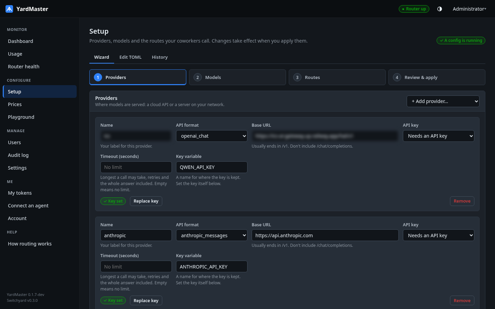
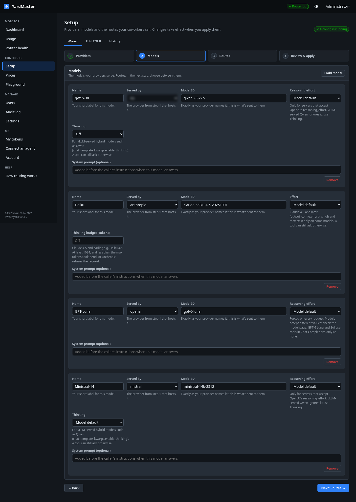
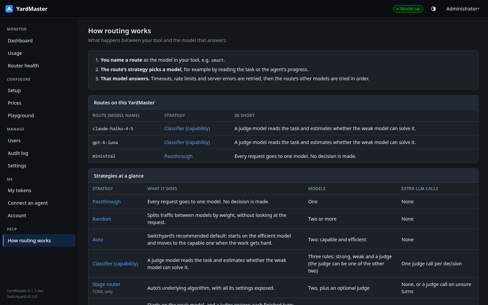
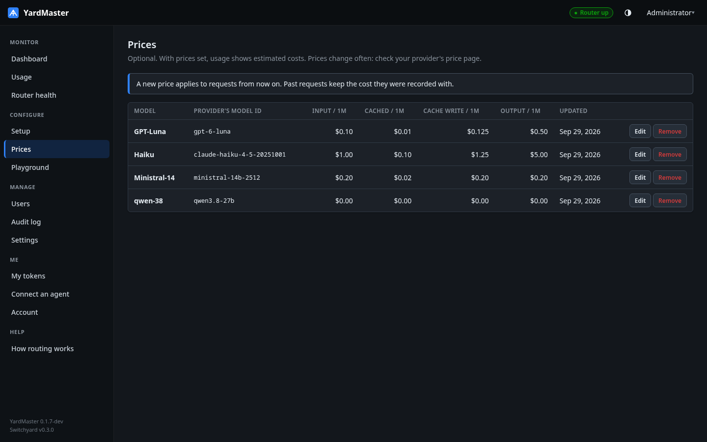
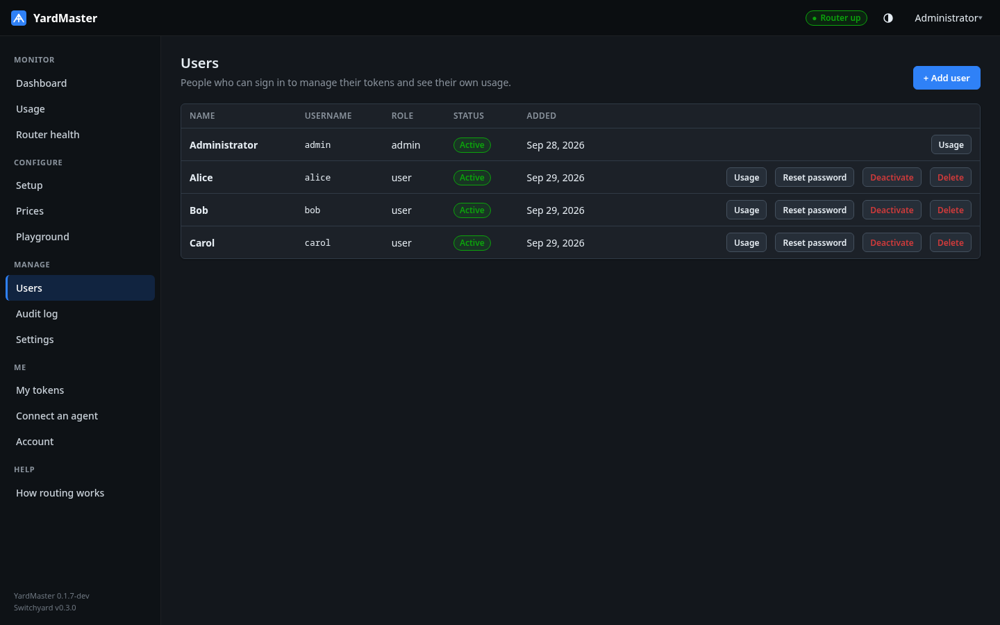
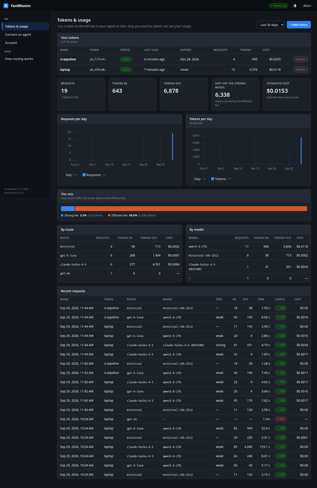
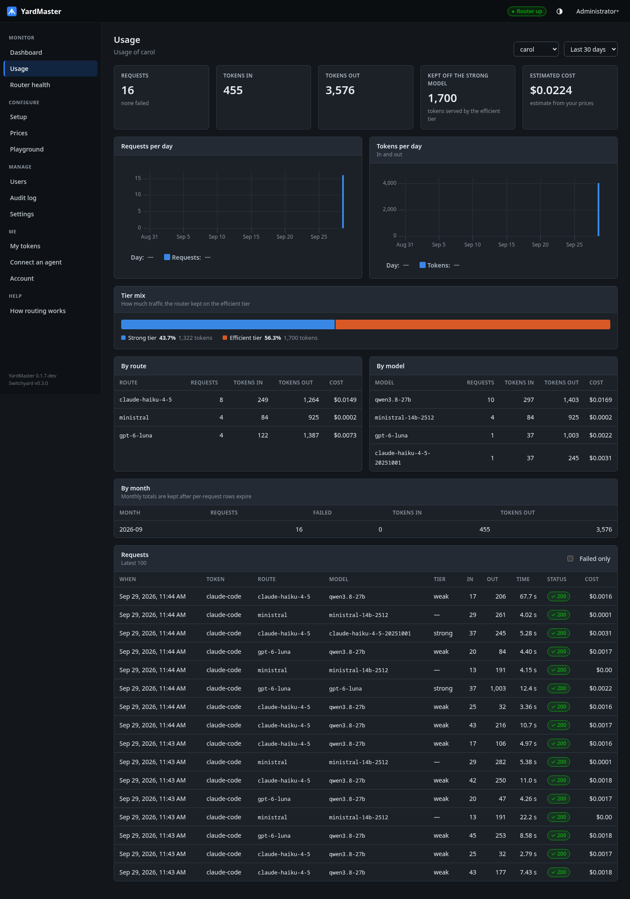
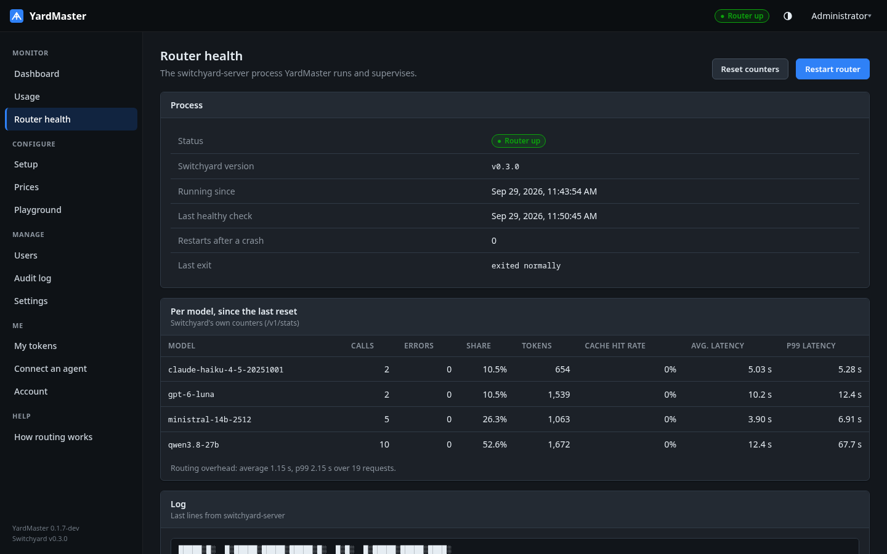

# User guide

This guide follows YardMaster in the order you meet it. The admin sets up the router and adds
people. Each person creates tokens and connects their tools. Then everyone watches the usage.
Installation is covered in [install.md](install.md).

YardMaster has two roles:

- **The admin** configures the router, manages users and sees everyone's usage.
- **Users** manage their own tokens and see only their own usage.

## Set up the router

**Setup** is a four-step wizard: providers, models, routes, then review and apply. If you'd rather
write TOML, use the **Edit TOML** tab. **History** keeps the last few configs you applied, so you
can go back to one.

### Providers

A provider is an API endpoint plus its key: OpenAI, Anthropic, an OpenAI-compatible service, or
a model you host yourself (vLLM, for example). Paste the base URL and the wizard suggests a name
and the name of the key. Keys are stored encrypted and never shown again. A key set as an
environment variable appears read-only. Each provider has its own timeout.

### Models

A model is a model name at a provider. Where the provider supports it, each model has reasoning
controls, in the format that provider accepts:

- **OpenAI:** reasoning effort.
- **Anthropic:** effort on Claude 4.6 and later; a thinking budget on older models.
- **vLLM-served models:** a thinking switch.

### Routes

A route is what your coworkers call. They put its name in their tool's model setting, and the
route decides which model answers. A route can send everything to one model, split traffic between
models, or use a judge model to send easy requests to a cheap model and hard ones to a strong one.

Every strategy has a **How does it work?** link, and **Help → How routing works** explains all of
them, including how to choose a judge.

### Apply

**Review & apply** checks the config with Switchyard itself and shows what changed. Applying
restarts the router gracefully: requests already in flight get time to finish. If the router
doesn't come back up healthy, YardMaster puts the previous config back automatically.

### Prices

**Prices** is optional. Enter a price per million tokens for each model, and the usage pages show
estimated costs. Until a model has a price, its cost shows as unknown, not as zero.

### Playground

**Playground** shows which model a route would pick for a message, without generating an answer.
Use it to check a threshold or a new judge before people depend on the route.

## Add people

**Users** is where the admin adds people. Each new user gets a temporary password, shown to you
once, to pass on. They choose their own password when they first sign in. From the same table you
can reset a password, deactivate someone (their tokens stop working immediately), or delete them.
A deleted person's past usage stays in the history under their username.

## Connect a tool

Each person signs in, creates tokens under **Tokens & usage** and uses them as the API key in
their tools. Tokens start with `ym_` and are shown once. You can give one an expiry date and revoke
it at any time. The page also shows the person's own usage, broken down by token, route and model.

**Connect an agent** has setup guides filled in with this YardMaster's address and routes, for
Claude Code, Codex CLI, OpenCode, Aider, Cline and Continue, the Python SDKs and curl. Any OpenAI-
or Anthropic-compatible tool works unchanged.

## Watch it run

The **Dashboard** is the live view. It shows the router's status, requests, tokens, latency and
errors over the last hour, time spent choosing a model, the day's estimated cost, and the split
between the strong and efficient tiers. It also lists who used the router most today and the
latest errors.

**Usage** covers everyone or one person over a period you choose. It breaks usage down by route,
model, user and month, shows how many tokens the router kept off the strong model and what the
judge itself used, and lists the requests.

**Router health** shows the Switchyard process and its own per-model counters, and the last lines
of its log. You can restart the router or reset the counters from here.

**Audit log** records sign-ins, user and token changes, key changes, applied configs and settings
changes. It names what changed, never a secret.

## What YardMaster stores

Prompts and responses pass through YardMaster but are never stored. For each request it keeps
only metadata: who sent it, with which token, the route and model, the tier, the tokens in and
out, how long it took, and the status.
